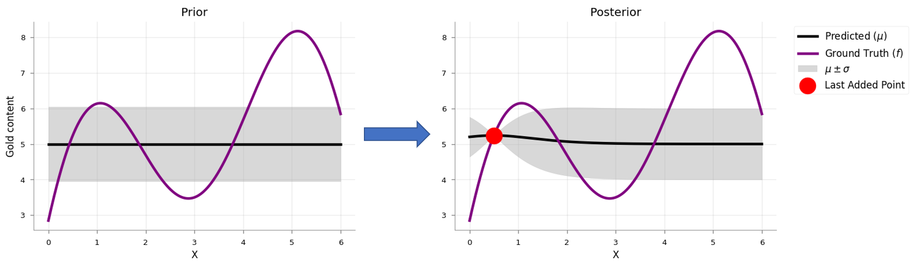
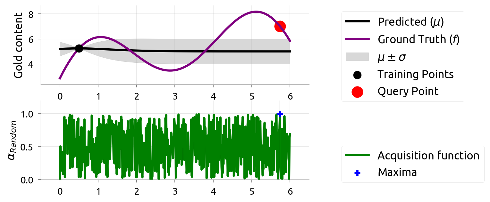

# Notes from Apoorv Agnihotri's Blog titled 'Exploring Bayesian Optimization' available at <https://distill.pub/2020/bayesian-optimization/>

> All credits to him and Nipun Batra sir!

## Intro

Assume we want to mine gold in an unknown land. Mining is costly so we cannot mine everywhere. Suppose the gold distribution $f(x)$ looks something like the function below. It is bi-modal (i.e. two maximas/minimas), with a maximum value around $x=5$

- **Problem 1: Best Estimate of Gold Distribution (Active Learning)** - Drill at locations providing high information about the gold distribution
- **Problem 2: Location of Maximum Gold (Bayesian Optimization)** - Drill at locations showing high promise about the gold content

## Active Learning

While there are various methods in active learning literature, we look at **uncertainty reduction**. This method proposes labeling (drilling) *the point whose model uncertainty is the highest*. Often, the variance acts as a measure of uncertainty.

Since we only know the true value of our function at a few points, we need a *surrogate model* for the values our function takes elsewhere. This surrogate should be flexible enough to model the true function.

> Using a **Gaussian Process (GP)** is a common choice, both because of its flexibility and its ability to give us uncertainty estimates.

Our surrogate model starts with a $\textrm{prior}$ of $f(x)$ — in the case of gold, we pick a $\textrm{prior}$ assuming that it's smoothly distributed. As we evaluate points (drilling), we get more data for our surrogate to learn from, updating it according to Bayes’ rule.

We started with uniform uncertainty. But after our first update, the $\textrm{posterior}$ is certain near $x=0.5$ and uncertain away from it. We should choose the next query point *smartly*. Although there are many ways, we will be picking the most uncertain one.

1. Choose and add the point with the highest uncertainty to the training set (by querying/labeling that point)
1. Train on the new training set
1. Go to #1 till convergence or budget elapsed

|   |   |    |     |
|---|---|--- | --- |
|  |  |  |  |

> The visualization shows that one can estimate the true distribution in a few iterations. **Furthermore, the most uncertain positions are often the farthest points from the current evaluation points.** At every iteration, active learning **explores the domain** to make the estimates better.

## Bayesian Optimisation

The above excercise may seem wasteful — why should we use evaluations improving our estimates of regions where the function expects low gold content when we only care about the maximum?

> This is the core question in Bayesian Optimization: "Based on what we know so far, which point should we evaluate next?"

In active learning, *we picked the most uncertain point, exploring the function*. But in Bayesian Optimization, we need to balance

- *exploring* uncertain regions, which might unexpectedly have high gold content
- *exploitating* regions we already know have higher gold content

> **Acquisition Functions**: Heuristics for how desirable it is to evaluate a point, based on our present model. They are inexpensive to calculate. These are meant to balance exploration and exploitation.

***V.IMP!***  
At every step, we determine what the best point to evaluate next is according to the acquisition function by optimizing it. We maintain a model describing our estimates and uncertainty at each point. The model is updated according to Bayes' rule. Repeat this process to determine the next point to evaluate. Our acquisition functions are based on this model.

## Formalising Bayesian Optimisation

Goal: Find location $ x \in ℝ^d$ corresponding to global max (or min) of function $f : ℝ^d ↦ ℝ $

| **General Constraint** | **Constraints in Gold Mining Example** |
|------------------------|----------------------------------------|
| $f$'s feasible set $A$ is simple, e.g., box constraints | Our domain in the gold mining problem is a single-dimensional box constraint: $0 ≤ x ≤ 6$ |
| $f$ is continuous but lacks special structure, e.g., concavity, that would make it easy to optimise | Our function is neither a convex nor a concave function, but bi-modal |
| $f$ is derivative-free, i.e., evaluations do not give gradient information. | Our evaluation (by drilling) of the amount of gold content at a location did not give us any gradient information |
| $f$ is expensive to evaluate | Drilling is costly |
| $f$ may be noisy. If noise, we assume it is independent and normally distributed, with common but unknown variance | We assume noiseless measurements in our modeling (though, it is easy to incorporate normally distributed noise for GP regression). |

Algorithm:

1. Choose a surrogate model for modeling the true function $f$ and define its **prior**.
1. Given the set of **observations** (function evaluations), use Bayes rule to obtain the **posterior**.
1. Use an acquisition function $α(x)$, which is a function of the posterior, to decide the next sample point $x_t = \textrm{argmax}_x α(x)$
1. Add newly sampled data to the set of **observations** and goto step #2 till convergence or budget elapses

> Surrogate posterior is not $f(x)$ but the current belief about $f(x)$ like a normal distribution $\cal{N}(μ_t(x), σ_t^2(x))$

## Acquisition Functions

### 1. Probability of Improvement (PI)

This chooses the next query point as the one which has the *highest probability of improvement* over the current $\textrm{max} f(x^+)$ (improvement of *atleast* $ϵ$). **Checks at how likely is an improvement, but not how much we can improve**. Selection of next point is -

$$ x_{t+1} = \textrm{argmax}(α_{PI}(x)) = \textrm{argmax}(P(f(x)≥(f(x^+)+ ϵ))) $$

> 

Where $x^+ = \textrm{argmax}_{x_i \in x_{1:t}}f(x_i)$ where $x_i$ is the location at $i_{th}$ time step

Looking closely, we are just finding the upper-tail probability (or the CDF) of the surrogate posterior. Moreover, if we are using a GP as a surrogate the expression above converts to,

$$
\begin{align*}
x_{t+1} &= \textrm{argmax}_x \Phi \left(\dfrac{μ_t(x) - f(x^+) - ϵ}{ϵ_t(x)} \right) \\
α_{PI}(x) &= \Phi \left(\dfrac{μ_t(x) - f(x^+) - ϵ}{ϵ_t(x)} \right)
\end{align*}
$$

Where $\Phi (\cdot) $ is the CDF

> **Key Insight:** The acquisition function is not a CDF itself, but *rather a function that uses the CDF at each point $x$ to compute how promising that point is*. In other words, at each $x$ we compute a CDF value.

Proof of why CDF (Still not fully clear!)

Assume $f(x)$ follows a Gaussian under the surrogate model e.g., GP like $f(x) ∼ \cal{N}(μ_t(x), σ_t^2(x))$

To calculate

$$
\begin{align*}
P(f(x)≥(f(x^+)+ ϵ)) &= P \left(\frac{f(x) - μ_t(x) }{σ_t(x)} ≥ \frac{f(x^+) + ϵ - μ_t(x) }{σ_t(x)} \right) \\
&= P(Z ≥ z) \quad \textrm{where we define}~ z = \frac{μ_t(x) - f(x^+) - ϵ}{σ_t(x)} \\
&= \Phi(z)
\end{align*}
$$

- The second figure $α_{PI}(x)$ i.e. Acquisition function vs $x$
  - green line being flat means model is confident (low $σ$) and does not expect better-than-best outcomes (low $μ$)
  - green line peaks at $x=6$ where the model thinks there is a good chance of improvement or is uncertain enough that its worth querying
- In the first figure
  - orange line represents the current max (plus an $ϵ$)
  - violet region shows the *probability density* at each point
  - grey regions show the *probability density* below the current max
  - area of the violet region at each point represents the *probability of improvement over current maximum*
- The next point to evaluate via the PI criteria (shown in dashed blue line) is $x=6$

> **Intuition behind $ϵ$ in PI**: $ϵ$ strikes a balance between exploration and exploitation. Increasing $ϵ$ results in querying locations with a larger $σ$ as their probability density is spread.

<table>
  <tr>
    <td colspan="4" align="center"> ϵ = 0.075 *(exploits)* </td>
  </tr>
  <tr>
    <td></td>
    <td></td>
    <td></td>
    <td></td>
  </tr>
</table>

*Observe how the new query point corresponds to the max of acquisition function*

> Our surrogate possesses a large uncertainty in $x∈[2,4]$ in the first few iterations. The acquisition function **initially exploits regions with a high promise**, which leads to high uncertainty in the region $x∈[2,4]$. This observation also shows that we do not need to construct an accurate estimate of the black-box function to find its maximum.

<table>
  <tr>
    <td colspan="4" align="center"> ϵ = 0.3 *(explores)* </td>
  </tr>
  <tr>
    <td></td>
    <td></td>
    <td></td>
    <td></td>
  </tr>
</table>

### 2. Expected Improvement (EI)

Considers how much we can improve. Choose the next query point as the one which has the highest expected improvement over the current max $f(x^+)$

$$ x_{t+1} = \textrm{argmin}_{x} \mathbb{E} (|| h_{t+1}(x) - f(x^*)|| ~ | \cal{D}_t) $$

Where,

- $f$ is the actual ground truth function
- $h_{t+1}$ is the posterior mean of the surroggate at {t+1}^{th} timestep
- $\cal{D}_t$ is the training data $\{(x_i, f(x_i)) \} ∀ x \in x_{1:t}$
- $x^*$ is the actual position wher $f$ takes the maximum value

> *In essence, we are trying to select the point that minimizes the distance to the objective evaluated at the maximum.*

Unfortunately, we do not know the ground truth function, $f$. Mockus (an author) proposed the following acquisition function to overcome the issue.

$$ x_{t+1} = \textrm{argmax}_{x} \mathbb{E} \left( \max \{0, h_{t+1}(x) - f(x^+)\}~ | \cal{D}_t \right) $$

where

- $f(x^+)$ is the maximum value that has been encountered so far.

The equation for GP surrogate is -

$$
EI(x) =
\begin{cases}
(\mu_t(x) - f(x^+) - \epsilon) \Phi(Z) + \sigma_t(x) \phi(Z), & \text{if } \sigma_t(x) > 0 \\
0, & \text{if } \sigma_t(x) = 0
\end{cases}
$$

> Note how this is a weighted sum involving both CDF ($\Phi$) and PDF ($\phi$)

where

- $\mu_t(x)$: model's predicted mean at point **x**
- $\sigma_t(x)$: model's predicted uncertainity at point **x**
- $f(x^+)$: max or best value so far
- $Z = \frac{\mu_t(x) - f(x^+) - \epsilon}{\sigma_t(x)} $

- $\Phi(\cdot)$ indicates the **CDF** of the standard normal distribution -- probabilty we improve.  
- $\phi(\cdot)$ indicates the **PDF** of the standard normal distribution -- how spread out the distribution is.

From the above expression, we can see that *Expected Improvement* will be high when:  

1. this point is much better than current best, i.e., expected value of $\mu_t(x) - f(x^+)$ is high
1. when the uncertainty $\sigma_t(x)$ around a point is high (we expect a better point where there is a high uncertainity)

<table>
  <tr>
    <td colspan="4" align="center"> ϵ = 0.075 *(exploits)* </td>
  </tr>
  <tr>
    <td></td>
    <td></td>
    <td></td>
    <td></td>
  </tr>
</table>

<table>
  <tr>
    <td colspan="4" align="center"> ϵ = 0.03 *(explores)* </td>
  </tr>
  <tr>
    <td></td>
    <td></td>
    <td></td>
    <td></td>
  </tr>
</table>

### 3. Thompson Sampling

At every step, we randomly sample a function from the surrogate's (e.g. GP) posterior (given the evidence) and optimise it. Evaluate (drill) wherever the surrogate posterior peaks.

> ***VIMP***   **Posterior from surrogate:** Assume we have already built a surrogate model (like a GP), which gives a ***distribution over functions, not just a single prediction***. That is, for each point $x$, it tells *(i)* a mean $μ(x)$ and *(ii)* a variance $σ^2(x)$

Figure shows three sampled functions from the learned surrogate posterior for our gold mining problem. The training data constituted the point $x=0.5$ and the corresponding functional value.

We can understand the intuition behind Thompson sampling by two observations:

- Locations with high uncertainty $(σ(x))$ will show a large variance in the functional values sampled from the surrogate posterior. Thus, there is a non-trivial probability that a sample can take high value in a highly uncertain region. Optimizing such samples can aid **exploration**.  
As an example, the three samples (sample #1, #2, #3) show a high variance close to $x=6$. Optimizing sample 3 will aid in exploration by evaluating $x=6$.

- The sampled functions must pass through the current max value, as there is no uncertainty at the evaluated locations. Thus, optimizing samples from the surrogate posterior will ensure **exploiting** behavior.  
As an example of this behavior, we see that all the sampled functions above pass through the current max at $x=0.5$. If $x=0.5$ were close to the global maxima, then we would be able to exploit and choose a better maximum.

<table>
  <tr>
    <td colspan="4" align="center">  </td>
  </tr>
  <tr>
    <td></td>
    <td></td>
    <td></td>
    <td></td>
  </tr>
</table>

### 4. Random

We can create a random acquisition function by sampling $x$ randomly.

<table>
  <tr>
    <td colspan="4" align="center">  </td>
  </tr>
  <tr>
    <td></td>
    <td></td>
    <td></td>
    <td></td>
  </tr>
</table>

Performance of the random acquisition function is not that bad! However, if our optimisation was more complex (more dimensions), then the random acquisition might perform poorly.

### Other Acquisition Functions

#### Upper Confidence Bound (UCB)

Combines the exploration/exploitation tradeoff as a linear combination of the mean and uncertainty of our surrogate model

$$ α(x)=μ(x)+λ \cdot σ(x) $$

#### Probability of Improvement + $λ \cdot $ Expected Improvement (EI-PI)

#### Gaussian Process Upper Confidence Bound (GP-UCB)

Before talking about GP-UCB, let us quickly talk about ***regret***. Imagine if the maximum gold was $a$ units, and our optimization instead samples a location containing $b<a$ units, then our regret is $a−b$. If we accumulate the regret over $n$ iterations, we get **cumulative regret**.
GP-UCB's formulation is given by:

$$ α_{\text{GP-UCB}}(x) = μ_t(x) + \sqrt{\beta} σ_t(x) $$

Where $t$ is the timestep.

### Summary of Acquisition Functions

- They are heuristics for evaluating the utility of a point
- They are a function of the surrogate posterior
- They combine exploration and exploitation
- They are inexpensive to evaluate

## Hyperparameter Tuning

> Hyperparameters are set before learning and the parameters are learned from the data

Consider Ridge regression -

$$
\hat{\theta}_{\text{ridge}} = \textrm{argmin}_{\theta \in \mathbb{R}^p} \sum_{i=1}^{n} \left( y_i - x_i^T \theta \right)^2 + \lambda \sum_{j=1}^{p} \theta_j^2
$$

> Weight matrix ($\theta$) is a parameter, regularization coefficient ( $\lambda \geq 0$ ) is a hyperparameter. If we solve via gradient descent, we introduce learning rate parameter $\alpha$

*The author says Bayesian Optimisation is commonly used in such hyperparameter tuning exercises. Especially when grid searches are not feasible due to expensive function evaluations*
